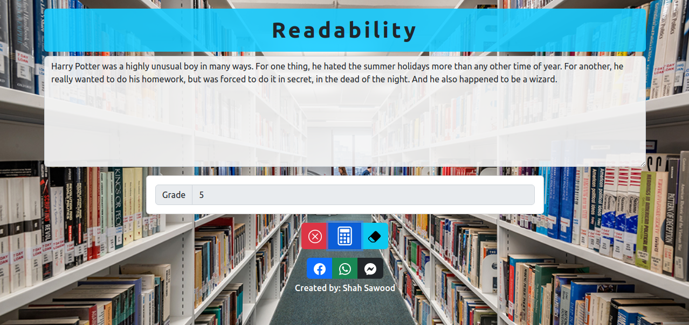

# Readability
Readability is a web-based program implemented in **[html](https://developer.mozilla.org/en-US/docs/Web/HTML), [css](https://developer.mozilla.org/en-US/docs/Web/CSS), [javascript](https://developer.mozilla.org/en-US/docs/Web/JavaScript)** that computes the approximate grade level needed to comprehend some text.

## Reading Levels
According to [Scholastic](https://www.scholastic.com/teachers/teaching-tools/collections/guided-reading-book-lists-for-every-level.html), E.B. White’s “Charlotte’s Web” is between a second and fourth grade reading level, and Lois Lowry’s “The Giver” is between an eighth grade reading level and a twelfth grade reading level. What does it mean, though, for a book to be at a “fourth grade reading level”?

Well, in many cases, a human expert might read a book and make a decision on the grade for which they think the book is most appropriate. But you could also imagine an algorithm attempting to figure out what the reading level of a text is.

So what sorts of traits are characteristic of higher reading levels? Well, longer words probably correlate with higher reading levels. Likewise, longer sentences probably correlate with higher reading levels, too. A number of “readability tests” have been developed over the years, to give a formulaic process for computing the reading level of a text.

One such readability test is the Coleman-Liau index. The Coleman-Liau index of a text is designed to output what (U.S.) grade level is needed to understand the text. The formula is:

```
index = 0.0588 * L - 0.296 * S - 15.8
```

Here, L is the average number of letters per 100 words in the text, and S is the average number of sentences per 100 words in the text.

## Usage
For example, if user types in a line from Dr. Seuss into our Textbox:
```
Congratulations! Today is your day. You're off to Great Places! You're off and away!
Grade 3
```

## Demonstration


## Testing
* ```One fish. Two fish. Red fish. Blue fish.``` (Before Grade 1)
* ```Would you like them here or there? I would not like them here or there. I would not like them anywhere.``` (Grade 2)
* ```Congratulations! Today is your day. You're off to Great Places! You're off and away!``` (Grade 3)
* ```Harry Potter was a highly unusual boy in many ways. For one thing, he hated the summer holidays more than any other time of year. For another, he really wanted to do his homework, but was forced to do it in secret, in the dead of the night. And he also happened to be a wizard.``` (Grade 5)
* ```In my younger and more vulnerable years my father gave me some advice that I've been turning over in my mind ever since.``` (Grade 7)
* ```Alice was beginning to get very tired of sitting by her sister on the bank, and of having nothing to do: once or twice she had peeped into the book her sister was reading, but it had no pictures or conversations in it, "and what is the use of a book," thought Alice "without pictures or conversation?"``` (Grade 8)
* ```When he was nearly thirteen, my brother Jem got his arm badly broken at the elbow. When it healed, and Jem's fears of never being able to play football were assuaged, he was seldom self-conscious about his injury. His left arm was somewhat shorter than his right; when he stood or walked, the back of his hand was at right angles to his body, his thumb parallel to his thigh.``` (Grade 8)
* ```There are more things in Heaven and Earth, Horatio, than are dreamt of in your philosophy.``` (Grade 9)
* ```It was a bright cold day in April, and the clocks were striking thirteen. Winston Smith, his chin nuzzled into his breast in an effort to escape the vile wind, slipped quickly through the glass doors of Victory Mansions, though not quickly enough to prevent a swirl of gritty dust from entering along with him.``` (Grade 10)
* ```A large class of computational problems involve the determination of properties of graphs, digraphs, integers, arrays of integers, finite families of finite sets, boolean formulas and elements of other countable domains.``` (Grade 16+)


Please note that readability is a [pset](https://cs50.harvard.edu/x/2021/psets/2/readability/) in cs50x implemented in C.
